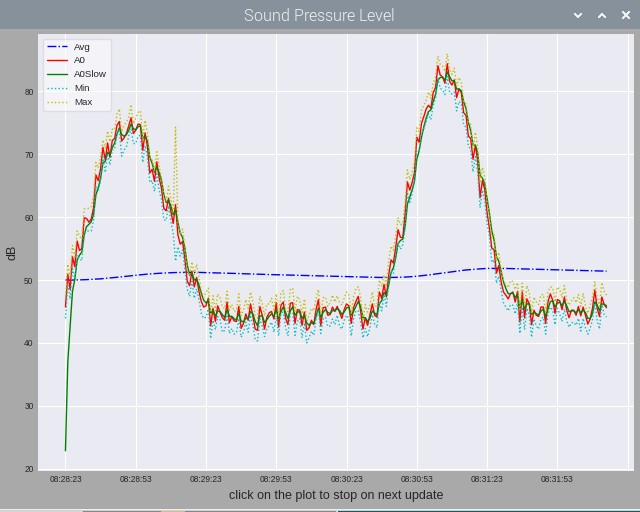

# Pi-Arduino_Ser_Plotter_Logger
The Arduino IDE provides a very convenient serial plotter. The drawback is that you need to load the complete IDE to use it.

The other drawback is also that this functionality is not easily tweakable by the user.
The standard plot has also only numbers on the x-axis, having the time is currently not foreseen.

This project intends to provide a similar + better plotter functionality that can be invoked directly from Python, without requiring to load the bulky IDE, with the advantage that everybody can tweak it to his own needs.
Currently the program is written for plotting five floating point values at a 1 second pace, that are issued on the serial port separated by spaces e.g. here an example for plotting a value and 4 derivates (long-term average, smoothed value, maximum and minimum):

Serial.print(Avg);  Serial.print(" "); Serial.println(A0dB); Serial.print(" "); Serial.print(A0dBslow); Serial.print(" "); Serial.print(A0Min);   Serial.print(" "); Serial.println(A0Max); 

The first line of the serial flow may contain the descriptors with same number of  parameters.
The data will be plotted for the last 5 min. with a picture update every 10 seconds to reduce the workload.

Additionally the data is written to a daily log file yy-mm-dd.log for further usage.
Every log contains data from 01:00 to 00:59 of the next day.
The offset of one hour is intentional, since the time around midnight is of special interest and should not be split between two logs.

The ecosystem is completed with another Python script ( currently LogPlotter22.py) that reads (parts of) existing plots back into plots.

Changelog:

Displays serial data from an Arduino on a Raspberry Pi.

Latest progress and future planned additons :-

-Avoiding the errors at the beginning, when python gets an empty line and the line with headers (done)

-Classifiying the line type into waiting for sync, header, data and error (done)

-Changing the log to display each line with the line type at the beginning (done)

-Making the number/names of plots depending on the header line (tbd)

-Making the serial port an optional, persistent parameter of the python script (done)

-Changing the log to be daily logs (done)

-Elaborating stats on the past hour, day, month... (tbd)

