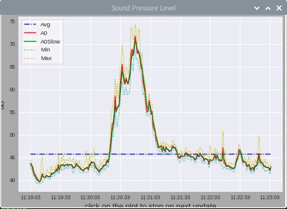

# Pi-Arduino_Ser_Plotter

Displays serial data from an Arduino on a Raspberry Pi.

Latest progress and future planned additons :-

-Avoiding the errors at the beginning, when python gets an empty line and the line with headers (done)

-Classifiying the line type into waiting for sync, header, data and error (done)

-Changing the log to display each line with the line type at the end (done)

-Making the number of plots depending on the header line (tbd)

-Making the serial port an optional, persistent parameter of the python script (tbd)

-Changing the log to be two alternating hourly logs (odd,even) (tbd)

-Elaborating stats on the past hour, day, month... (tbd)

-Writing at the end of every hour the last log into a disk file and appending the hourly stats...(tbd)
